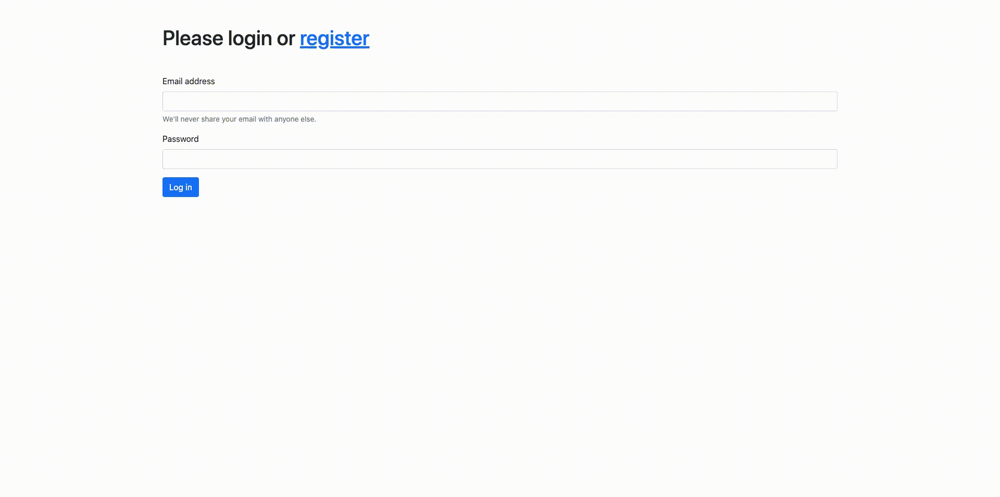

#  Virtual Wallet App 

## To start the project, run following commands in cmd/terminal:

## Clone the repository:

git clone git@github.com:Georgkali/Virtual-wallet.git

## Switch to the repo folder:

cd Virtual-wallet

## Install all the dependencies using composer:

composer update

## Copy the example env file and make the required configuration changes in the .env file:

cp .env.example .env

## Generate a new application key:

php artisan key:generate

## Run the database migrations (Set the database connection in .env file before migrating):

php artisan migrate

## Start the local development server:

php artisan serve

## You can now access the app at http://localhost:8000

